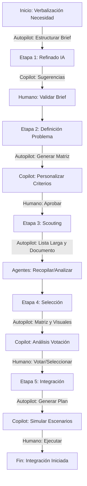
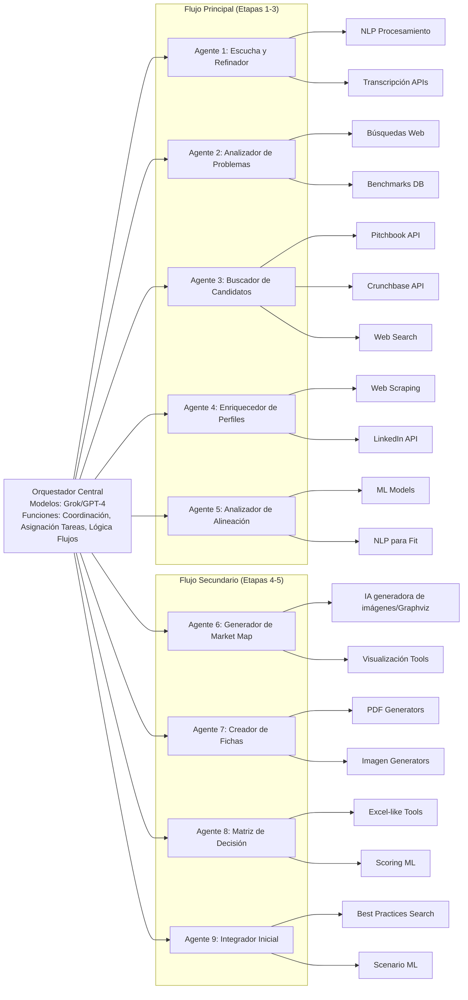

# Sistema de IA para Scouting de Innovación

## Introducción
Este documento describe una solución integral basada en IA para potenciar el proceso de scouting de innovación, tal como se detalla en "Scouting innovacion.md". Es una visión de "máximos" que automatiza lo posible, mitiga debilidades humanas y mantiene control en etapas críticas. El sistema usa un orquestador central que coordina agentes IA especializados, con acceso a herramientas como APIs de Pitchbook, búsquedas en internet y generación de visuales.

El proceso se divide en etapas, indicando para cada una:
- **Autopilot**: IA opera de forma autónoma (e.g., recopilación de datos).
- **Copilot**: IA asiste al humano, mitigando debilidades como sesgos o fatiga (e.g., sugerencias para validación).
- **Humano 100%**: Intervención manual obligatoria (ejemplos: decisiones finales).

El sistema reduce tiempo, aumenta cobertura y mejora objetividad, además de incluir checkpoints humanos para ética y precisión.

## Estructura General del Sistema
- **Orquestador Central**: Agente IA que gestiona flujos, asigna tareas y asegura coherencia (basado en modelos razonadores (GPT-5, Gemini, Grok, etc.) con herramientas integradas).
- **Agentes Especializados**: Cada uno enfocado en una tarea, con herramientas como:
  - APIs: Pitchbook, Crunchbase para datos de startups.
  - Búsquedas: Deep research en web (noticias, patentes, LinkedIn).
  - Análisis: NLP para insights, ML para scoring.
  - Visualización: Generación de imágenes y diagramas.
- **Flujos**: Principal (scouting y documento) y Secundario (revisión y outputs visuales).

## Desglose del Proceso por Etapas
Basado en el proceso original, con potenciación IA.

### Etapa 1: Verbalización de la necesidad por las unidades de negocio
- **Descripción**: Las unidades describen el reto de forma informal.
- **Inputs**: Descripción informal (texto, voz o formulario) de las unidades de negocio; datos históricos de retos similares (opcional, de base interna).
- **Outputs**: Brief estructurado (documento Markdown/JSON con keywords extraídos, categorización del reto, sugerencias de refinamientos); resumen narrativo para validación.
- **Potenciación IA**: Agente "Escucha y Refinador" procesa inputs (texto/voz) para estructurar el brief.
- **Modo**:
  - **Autopilot**: Extracción automática de keywords y categorización (mitiga ambigüedades iniciales).
  - **Copilot**: Sugerencias de refinamientos basados en históricos, para revisión humana.
  - **Humano 100%**: Validación final del brief estructurado.
- **Beneficios**: Reduce malentendidos desde el inicio.

### Etapa 2: Definición del problema
- **Descripción**: Detallar el problema con inputs de stakeholders.
- **Inputs**: Brief estructurado de Etapa 1; inputs adicionales de stakeholders (e.g., correos, reuniones transcritas); benchmarks externos (vía búsquedas).
- **Outputs**: Matriz de problema (tabla con aspectos clave como alcance, restricciones, verticales); lista de criterios de evaluación estandarizados/personalizados; informe de benchmarks (resumen de problemas similares resueltos).
- **Potenciación IA**: Agente "Analizador de Problemas" recopila y formaliza, sugiriendo criterios de evaluación.
- **Modo**:
  - **Autopilot**: Búsqueda de benchmarks y generación de matriz de problema.
  - **Copilot**: Análisis semántico para mapear a verticales, asistiendo en la personalización de criterios.
  - **Humano 100%**: Aprobación de criterios estandarizados/personalizados.
- **Beneficios**: Crea base data-driven para scouting.

### Etapa 3: Scouting por el equipo de innovación
- **Descripción**: Generar lista larga, market map y selección inicial.
- **Inputs**: Matriz de problema y criterios de Etapa 2; parámetros de búsqueda (e.g., verticales, funding stage).
- **Outputs**: Lista larga de startups (e.g., 50-100 entradas en CSV/JSON); documento estructurado por empresa (perfiles con funding, equipo, productos, análisis de alineación); insights preliminares (resumen de patrones en el ecosistema).
- **Potenciación IA**: Flujo principal con orquestador coordinando agentes para lista larga y documento estructurado.
- **Modo**:
  - **Autopilot**: Recopilación y análisis de datos (e.g., lista de 50-100 startups con perfiles estructurados).
  - **Copilot**: Generación de insights y scoring preliminar, para revisión humana de anomalías.
  - **Humano 100%**: Ninguno aquí; esta etapa está mayormente automatizada, pero con opción de intervención si se detectan errores.
- **Beneficios**: Cobertura masiva y rápida.

### Etapa 4: Selección del candidato
- **Descripción**: Votación y ranking.
- **Inputs**: Documento estructurado de Etapa 3; votaciones y comentarios humanos (del sistema de votación existente).
- **Outputs**: Matriz de decisión (tabla comparativa con scores automáticos); market map (imagen visual del ecosistema); fichas de empresas seleccionadas (imágenes/PDF con perfiles resumidos); ranking final (lista priorizada con justificaciones).
- **Potenciación IA**: Flujo secundario para matriz de decisión, market map y fichas.
- **Modo**:
  - **Autopilot**: Cálculo de scores y generación de matriz comparativa.
  - **Copilot**: Integración con sistema de votación, analizando comentarios para highlights (mitiga sesgos en votaciones).
  - **Humano 100%**: Votación final y selección del candidato (decisión estratégica).
- **Beneficios**: Objetividad en pre-selección.

### Etapa 5: Inicio del proceso de integración
- **Descripción**: Planificar integración con el seleccionado.
- **Inputs**: Candidato seleccionado y su ficha de Etapa 4; datos adicionales (e.g., contratos templates, best practices).
- **Outputs**: Plan de integración preliminar (roadmap en documento con pasos, timelines, riesgos); simulación de escenarios (reporte con predicciones de outcomes); lista de best practices (resumen curado de casos similares).
- **Potenciación IA**: Agente genera plan preliminar.
- **Modo**:
  - **Autopilot**: Búsqueda de best practices y generación de roadmap.
  - **Copilot**: Simulación de escenarios para asistir en planificación.
  - **Humano 100%**: Ejecución y negociación de integración.
- **Beneficios**: Acelera arranque con templates data-driven.

## Consideraciones Adicionales
- **Mitigación de Debilidades**: Autopilot para tareas repetitivas (reduce fatiga); Copilot para análisis complejos (mitiga sesgos); Humano para ética/decisiones.
- **Riesgos**: Datos inexactos (mitigado con validaciones); Privacidad (usar APIs seguras).
- **Implementación**: Modular, escalable; integrar con herramientas existentes.

## Diagrama de Flujo (Mermaid)

Este diagrama muestra el flujo secuencial con indicación de modos.

## Diagrama de Arquitectura de Agentes (Mermaid)
Este diagrama enfoca la arquitectura técnica, mostrando el orquestador central conectado a cada agente especializado, y las herramientas asociadas a cada agente como subconexiones directas. Incluye agrupación por flujos y etapas para indicar la pertenencia de cada agente.

Este diagrama ilustra las conexiones directas: el orquestador a agentes, y agentes a sus herramientas específicas, sin elementos humanos, con agrupación por etapas.
